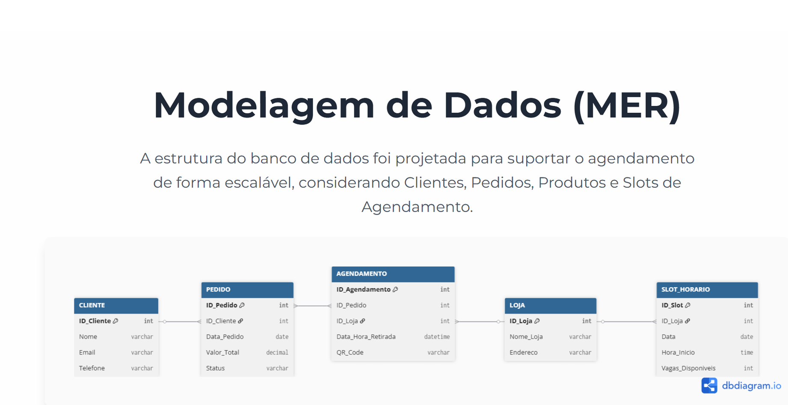

# 🛒 Swift - Clique e Retire Express

> Solução de agendamento e otimização para a jornada O2O (Online-to-Offline) da Swift, desenvolvida como Challenge para a FIAP.

---

## 📝 O Problema

Durante a análise da jornada de compra dos clientes Swift, identificámos três principais barreiras na modalidade de levantamento em loja física:
* **Incerteza no Levantamento:** Filas inesperadas e tempo de espera na loja que quebram a agilidade da compra online.
* **Checkout Desconectado:** O processo de finalização de compra online não dá controlo ao cliente sobre quando e como vai levantar o produto.
* **Falta de Conveniência:** Clientes com pouco tempo desistem da compra por receio de demorarem muito na loja.

---

## 💡 A Solução: Clique e Retire Express

O **Clique e Retire Express** é uma funcionalidade integrada no checkout que permite ao cliente agendar um horário exato para o levantamento da sua encomenda. 
1. **Agendamento:** Após o pagamento, o cliente escolhe um intervalo de horário disponível na loja selecionada.
2. **Código QR de Libertação:** O sistema gera um Código QR exclusivo para a compra.
3. **Levantamento Instantâneo:** Na loja, basta digitalizar o código num terminal de autoatendimento para libertar a encomenda imediatamente, eliminando filas e o contacto direto com o funcionário da caixa.

---

## 🖥️ Demonstração do Protótipo

Como o projeto foi desenvolvido com tecnologias web nativas, pode testar a interface do protótipo diretamente no seu navegador!

👉 **[Clique aqui para aceder ao protótipo a correr ao vivo!]https://vitorhugolecryman.github.io/swift-clique-retire-express/**

*Dica: Pode também consultar o documento completo com toda a pesquisa e apresentação na raiz deste repositório no ficheiro `Sprint_Switft.pdf`.*

---

## 🏗️ Arquitetura e Modelação de Dados

Para suportar o agendamento de forma escalável e integrada com as lojas físicas, modelámos uma base de dados relacional que liga Clientes, Encomendas, Lojas e Vagas de Horários.

### Principais Entidades:
* **CLIENTE:** Registo e credenciais dos utilizadores.
* **PEDIDO:** Registo das compras realizadas no e-commerce.
* **SLOT_HORARIO:** Controlo de vagas disponíveis por horário em cada unidade da Swift.
* **LOJA:** Unidades físicas integradas no sistema de levantamento.
* **AGENDAMENTO:** Entidade que liga a Encomenda à Vaga de Horário e gera o Código QR único.

---

## 🛠️ Tecnologias Utilizadas

O protótipo responsivo foi construído utilizando:
* **HTML5** & **CSS3** (Estrutura e Estilização)
* **Bootstrap 5** (Responsividade e componentes visuais rápidos)
* **JavaScript** (Lógica do simulador de agendamento e geração do Código QR)
* **dbdiagram.io** (Modelação de dados)

---

## 👥 Equipa (FIAP - 2º Semestre)
* **Vitor Hugo Dantas Tavares** - RM: 559349
